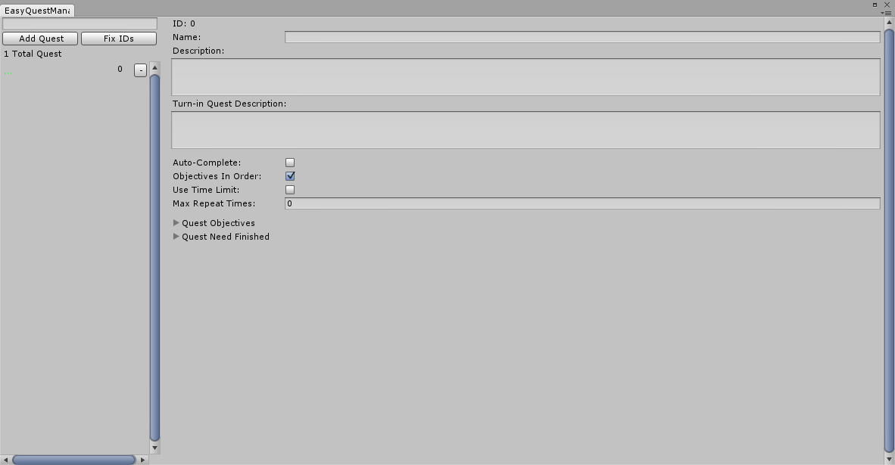

# Creating Quest

## 1. Opening EasyQuest Editor

First, make sure you have a EasyQuestManager object as mentioned in the setup phase.

To open the EasyQuest Manager window, you can either:    
1. Go to "Tools/EasyQuest/EasyQuest Edtior"    
2. On the gameobject with the "EasyQuestManager" script, press **Open Quest Editor Window**    

Once it's open, to create a quest you just have to press the "Add Quest" button.
Now the window should look like this.

For an explanation of what everything means, go to [Easy Quest Editor Reference](EasyQuestEditorReference.md)
