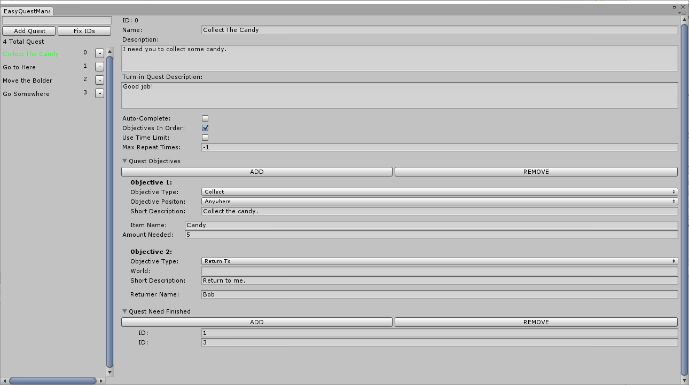

# EasyQuest Editor Reference

## Sidebar
* Searchbar - Search for a quest by name.
* Add Quest - Adds a quest to the list.
* Fix IDs - Fixes any gaps in IDs, along with properly updating the references to quest that have their IDs changed.

## Quest Info (Main Window)
* ID - The ID of the quest. this is determined by it's initial place in the list.
* Name - The name of the quest.
* Description - The description of the quest.
* Turn-In Quest Description - Optional dialog you can use when the quest is turned in.
* Auto Complete - If the quest should be completed as soon as all objectives are complete.
* Objectives In Order - If the objectives have to be completed in order.
* Max Repeat Times - How many times the quest can be done. Set to -1 for an infinite amount of times.

### Quest Objectives (General)
* Objective Type - The type of objective.
* Scene - The scene this quest happens in. This looks to see if any of the currently loaded scenes are it. If blank, doesn't care about the scene.
* Short Description - Optional description of the objective that you can display for the player.

#### Quest Objective (Go To)
* Position - The position the player has to go to.
* Max Distance Away - How close the player has to be before the objective is considered complete.

#### Quest Objective (Collect/Defeat)
* Objective Position - If this quest is scene and/or position based.
* Item/Enemy Name - The name of the item/enemy being tracked.
* Amount Needed - How many of the item/enemy is needed.

#### Quest Objective (Move Obj)
* Object Name - The name of the object. Used when grabbing a reference to the gameobject.
* Position - The position it needs to be in.
* Compensation - How fat the player can be before considered at the position.

#### Quest Objective (Return To/Talk To)
* Returner/Conversation Name - The name of who you have to return to. This doesn't have to be the gameobject's name, you can learn about this in the [Handling Quest](HandlingQuest.md) section.

### Quest Need Finished
Add here the IDs of the quest that need to be completed before this one becomes avaliable. 
